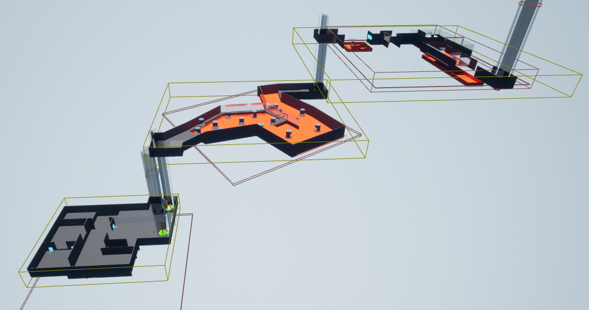

# Project Wallker -If there is a wall, there is a way-
Project Wallker is a gameplay prototype that was created using [Unreal Engine 4](https://www.unrealengine.com).

This project was endorsed and motivated by the Stuttgart Media University, located in Germany. 
This project took one semester to complete. (Summer Semester 2019) 

# What is the Gameplay about?
Basically, you, the Wallker, push yourself against walls to build up a vector that can then be activated at will. 

The Wallker not only saves the strength of the vector but also the direction of where the wall is "facing". That way we have contextual situations, depending on which wall the player used to build up the vectors. 

Activation of the vector will consumes the vector and trigger a dash that propells the player in the direction of the vector. This dash could be super freaking strong. 

There you have it! A nice gameplay element that has lots of use-cases: Be it crashing through objects, having some speedy races, jumping over obstacles or even pushing heavy objects. You name it! 

# Screenshots
Below you will find screenshots of the levels that were created in order for the project to have some substance:

